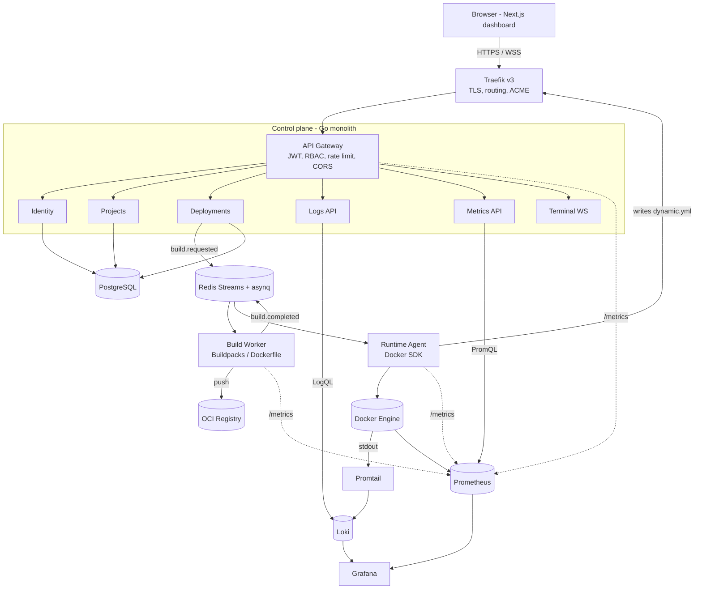
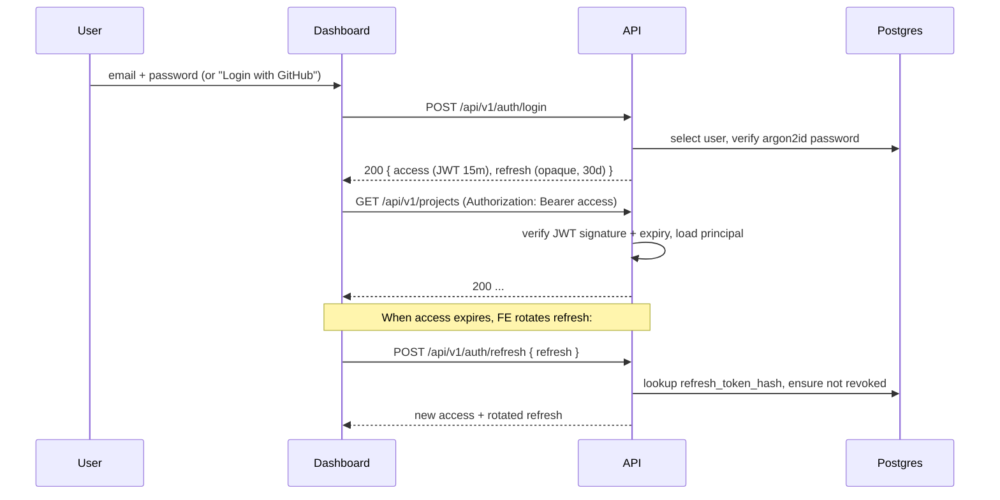
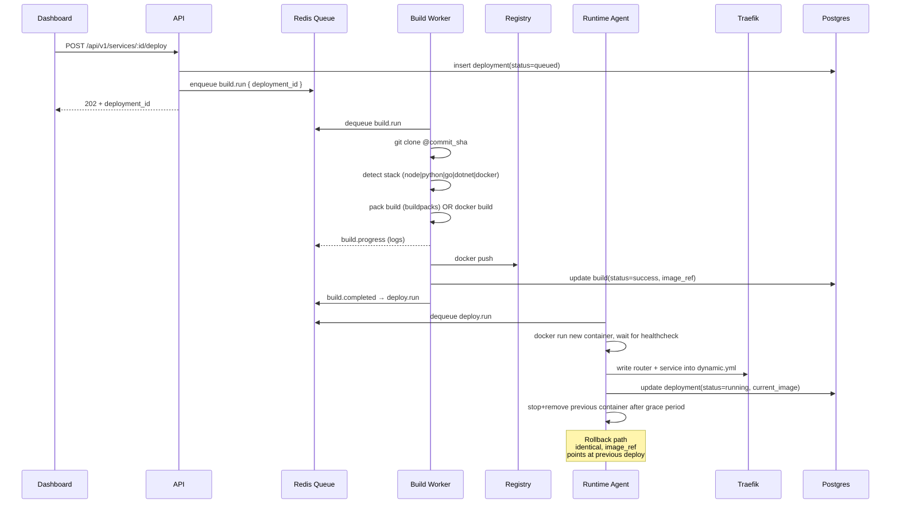

# NebulaCloud — Architecture

> A self-hosted PaaS in the spirit of Railway, Render, Heroku, and Vercel.

This document is the canonical engineering reference. It explains *why* the
platform is shaped the way it is, in addition to the *what*. It is intended
to make new contributors productive within an hour.

## Table of contents

1. [Goals and non-goals](#goals-and-non-goals)
2. [System overview](#system-overview)
3. [Service inventory](#service-inventory)
4. [Communication patterns](#communication-patterns)
5. [Module layout](#module-layout)
6. [Data model](#data-model)
7. [Authentication and authorization](#authentication-and-authorization)
8. [Build and deploy pipeline](#build-and-deploy-pipeline)
9. [Observability](#observability)
10. [Security](#security)
11. [Scalability and Kubernetes path](#scalability-and-kubernetes-path)
12. [MVP roadmap](#mvp-roadmap)

---

## Goals and non-goals

**Goals**

- Self-hosted, single-tenant or multi-org PaaS.
- Connect a Git repository → automatic build → containerised runtime → public HTTPS URL.
- First-class realtime: build logs, runtime logs, metrics, web terminal.
- Modular architecture that maps cleanly onto Kubernetes when the team is ready.
- Production-grade defaults: structured logs, health checks, RBAC, audit trail, encrypted secrets.

**Non-goals (for the MVP)**

- Multi-tenancy with strict isolation between orgs (single trust boundary in Phase 0–9).
- Cluster federation across regions.
- Proprietary buildpack ecosystem.
- Billing / quota enforcement (the data model leaves room for it).

## System overview



The platform separates **control plane** (decisions, persistence, API) from
**data plane** (image build + container runtime). The control plane is a
Go modular monolith for delivery speed; the data plane is split into two
independent binaries (`build-worker`, `runtime-agent`) that scale
horizontally and can later live on dedicated nodes.

## Service inventory

| Component        | Binary           | Scaling          | Owns                                           |
| ---------------- | ---------------- | ---------------- | ---------------------------------------------- |
| API Gateway      | `cmd/api`        | replica set      | HTTP surface, auth, RBAC, all module APIs      |
| Build Worker     | `cmd/build-worker` | horizontal (N) | clone, stack detect, buildpacks, image push    |
| Runtime Agent    | `cmd/runtime-agent` | per node      | container lifecycle, Traefik dynamic config    |
| PostgreSQL       | infra            | primary + replica | system of record                              |
| Redis            | infra            | single + sentinel | cache, sessions, asynq queue, event streams   |
| Traefik v3       | infra            | replica set      | TLS, routing, ACME                             |
| OCI Registry     | infra            | replica set      | image storage                                  |
| Prometheus       | infra            | single           | metrics                                        |
| Grafana          | infra            | single           | dashboards                                     |
| Loki + Promtail  | infra            | single + agents  | log aggregation                                |

## Communication patterns

| Path                          | Transport                | Why                              |
| ----------------------------- | ------------------------ | -------------------------------- |
| Browser ↔ API                  | HTTPS + JSON, WSS        | low latency, browser-native      |
| API module ↔ module           | in-process Go interfaces | Fast, no network, easy testing   |
| API → workers                 | Redis Streams + asynq    | durable, retryable, observable   |
| Workers → API (status)        | DB writes + events bus   | single source of truth           |
| API → user log store          | LogQL queries to Loki    | leverage Grafana stack           |
| Realtime build/runtime logs   | WS multiplexed via API   | one auth boundary for browser    |

When a module is later extracted into its own service, the contract simply
moves from a Go interface to a small HTTP/JSON or gRPC API. We avoid
distributed transactions: every write is owned by exactly one module.

## Module layout

Each module under `backend/internal/modules/<name>/` follows the same
four-layer DDD-lite layout:

```
<module>/
  domain/         # entities, value objects, repository interfaces. zero deps.
  application/    # use cases / services. orchestrates domain + repos.
  infrastructure/ # postgres repos, external clients (github, docker, ...)
  interfaces/     # http handlers, dtos, request validation
```

**Rule of thumb**

- `domain` may import nothing from this repo besides `platform/errors`.
- `application` may import `domain` and `platform/*`.
- `infrastructure` and `interfaces` may import everything below them.
- No module may import another module's `domain` or `application` directly.
  Cross-module collaboration goes through events (async) or through a
  **port** declared at the consumer side.

## Data model

Schema lives in `backend/migrations/0001_init.up.sql`. Highlights:

- `users`, `sessions`, `oauth_accounts`, `organizations`, `memberships(role)` for identity.
- `projects(repo_url, github_installation_id)`.
- `services(type, build_config, runtime_config, current_image, status)`.
- `env_vars(value_enc)` — payload encrypted with AES-256-GCM (`platform/secrets`).
- `deployments(commit_sha, status, image_ref, rolled_back_to)`.
- `builds(deployment_id, status, log_object_key, exit_code, duration_ms)`.
- `domains(hostname, ssl_status)`.
- `service_events` — append-only timeline.
- `audit_logs(actor_id, action, target_type, target_id, correlation_id)`.

Every table with `updated_at` automatically receives a trigger that
maintains the column.

## Authentication and authorization



- Access tokens: JWT, HS256 (rotatable to RS256), 15 min TTL, claims `sub, org, role, jti`.
- Refresh tokens: 256-bit opaque, stored hashed (sha256), rotated on every use, 30 day TTL.
- Passwords: Argon2id (`time=3, memory=64MB, threads=4`) with a server-side pepper.
- MFA: TOTP fields scaffolded; flow added in Phase 9.
- OAuth: GitHub App for both login *and* repo access. Installation token cached encrypted.
- RBAC: roles `admin > developer > viewer` with `Role.AtLeast()` predicates in middleware.

## Build and deploy pipeline



**Stack detection** rules (Phase 4):
1. `Dockerfile` present → use it as-is.
2. `package.json` → Node buildpack (Paketo Node).
3. `requirements.txt` / `pyproject.toml` → Python buildpack.
4. `go.mod` → Go buildpack.
5. `*.csproj` → .NET buildpack.
6. fallback → fail with actionable error.

## Observability

- **Logs** — every binary writes JSON to stdout via `log/slog` with fields
  `service, env, correlation_id, user_id, org_id, trace_id`. Promtail
  enriches Docker container logs with NebulaCloud labels (`org`, `project`,
  `service`, `deployment_id`) so Grafana can scope queries by tenant.
- **Metrics** — `/metrics` on every binary exposes RED HTTP metrics plus
  custom counters: `nebula_builds_total{status}`,
  `nebula_deploys_duration_seconds`, `nebula_container_restarts_total`.
- **Traces** — OpenTelemetry SDK is initialised in every binary; the
  exporter is a no-op by default and can be switched to OTLP via
  `NEBULA_OTLP_ENDPOINT` once a Tempo / Jaeger collector is online.
- **Correlation** — every HTTP request gets an X-Request-Id header (ULID).
  The id is propagated into queue payloads and surfaces in every audit
  record so a user-visible failure can be traced end-to-end.

## Security

See `SECURITY.md` for the full threat-model. Highlights:

- All inbound HTTPS via Traefik with HSTS / strict CSP / `X-Frame-Options: DENY`.
- Argon2id password hashing with a server-side pepper.
- AES-256-GCM-sealed env vars and OAuth tokens (`platform/secrets`).
- JWT + opaque rotated refresh tokens.
- Strict CORS allow-list, per-IP and per-user rate limiting.
- Audit trail on every privileged action with correlation id.
- User containers run as non-root, with `--security-opt no-new-privileges`,
  read-only rootfs where possible, CPU + memory limits.

## Scalability and Kubernetes path

The platform is born on Docker Compose for developer ergonomics, but every
service has been designed to lift onto Kubernetes:

- Stateless API → Deployment + HPA + Service.
- Build Worker → Deployment with KEDA (scale on Redis queue length).
- Runtime Agent → DaemonSet (one per node).
- Postgres → CloudNativePG / managed RDS.
- Redis → Bitnami chart / managed.
- Traefik → IngressController (already Kubernetes-aware).
- Prometheus + Grafana + Loki → kube-prometheus-stack chart.

The runtime layer is fronted by an `runtime.Orchestrator` interface; the
Phase 5 implementation is `dockerOrchestrator`, a future implementation
will be `kubernetesOrchestrator` and will replace the agent entirely
without changes to higher-level modules.

## MVP roadmap

| Phase | Theme                                  | Output                          |
| ----- | -------------------------------------- | ------------------------------- |
| 0     | Foundation (this repo)                 | infra + platform core           |
| 1     | Identity (auth, RBAC, audit)           | login / register / refresh      |
| 2     | Projects, services, env vars           | core CRUD + dashboard           |
| 3     | GitHub App + webhooks                  | repo connect, on-push trigger   |
| 4     | Build pipeline (Buildpacks)            | first image built and pushed    |
| 5     | Runtime agent + Traefik dynamic config | first running deployed app      |
| 6     | Realtime logs + metrics                | live tail in dashboard          |
| 7     | Custom domains + ACME                  | bring-your-own-domain           |
| 8     | Web terminal                           | shell into running container    |
| 9     | Hardening, tests, polish, docs         | production-ready                |
