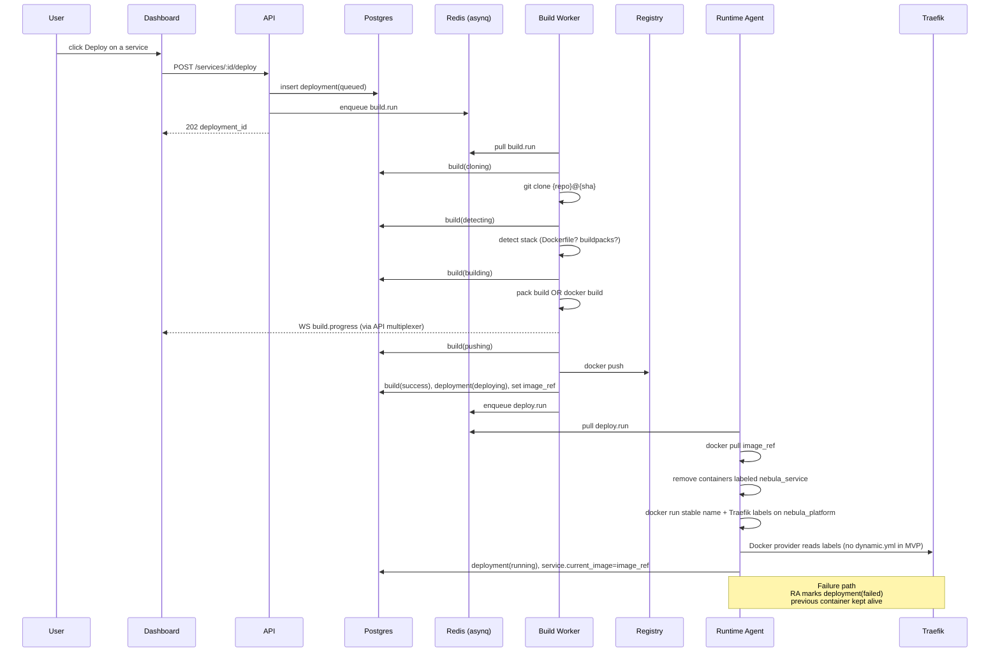
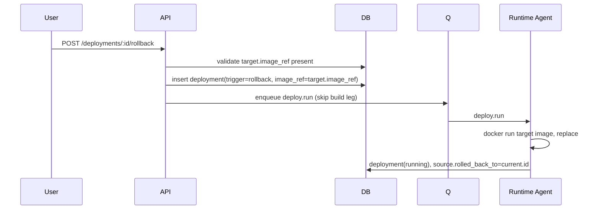

# NebulaCloud — Deploy Flow

This document describes the end-to-end lifecycle of a single deployment,
from "user clicks Deploy" to "container is serving traffic".

## States

A deployment moves through the following states (see `deployments.status`):

```
queued → building → pushing → deploying → running
                                       ↘ failed
                                       ↘ canceled
running → rolled_back  (when a newer deployment supersedes and a rollback is requested)
```

`builds.status` runs in parallel with the build leg:

```
queued → cloning → detecting → building → pushing → success
                                                  ↘ failed
                                                  ↘ canceled
```

## Sequence



### MVP runtime (local compose)

- Workloads join **`nebula_platform`** so Traefik’s Docker provider (same socket + network) can attach routers from container labels.
- **One container per service**: the agent deletes any container with `label=nebula_service=<uuid>` before starting the new revision under a **stable** container name (`nebula-svc-<prefix>`), avoiding orphaned containers from earlier deploys.
- **Not yet implemented** vs this document’s ideal path: file-based `dynamic.yml`, health-gated traffic switch, and automated rollback container swap (see Failure handling above for the target behaviour).

## Rollback



Rollback skips the build pipeline entirely; we re-use the already-pushed
image. This is what makes rollbacks fast and safe.

## Failure handling

- **Build failure**: deployment goes to `failed`. The previous running
  container is untouched.
- **Push failure**: same as build failure.
- **Container start / healthcheck failure**: agent stops the new container,
  restores the previous one, marks deployment `failed`.
- **Crash loop after rollout**: the agent emits `service.unhealthy` events.
  An auto-restart policy is applied (with exponential backoff and a cap).

## Webhooks (Phase 3+)

Pushes to a connected branch arrive on the GitHub webhook receiver
(`POST /api/v1/webhooks/github`). The handler:

1. Verifies the HMAC signature using `NEBULA_GITHUB_APP_WEBHOOK_SECRET` when configured.
2. Resolves projects by normalized `repo_url` and `default_branch` (from the push `ref`).
   When the payload includes `installation.id` and the project row has
   `github_installation_id` set, only projects for that installation match
   (avoids accidental deploys from fork URLs).
3. Inserts a deployment with `trigger='webhook'` and dispatches build.run for each service in matching projects.

Idempotency: GitHub may redeliver. We dedupe on `(service_id, commit_sha,
trigger)` within a 60s window.
